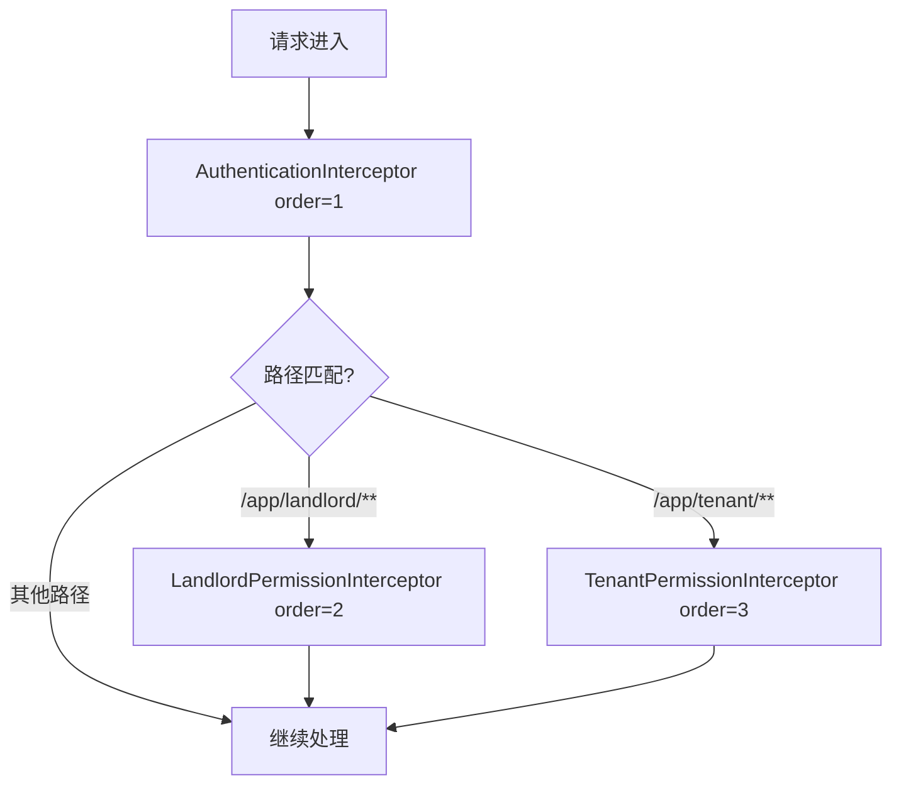

# 拦截器结构说明

## 📁 目录结构

```
interceptor/
├── common/                          # 🌐 共用拦截器
│   └── AuthenticationInterceptor.java  # 通用身份认证拦截器
├── landlord/                        # 🏠 房东专用拦截器
│   ├── LandlordPermissionInterceptor.java   # 房东权限验证拦截器
│   └── RequireLandlordPermission.java       # 房东权限注解
├── tenant/                          # 🏘️ 租客专用拦截器
│   ├── TenantPermissionInterceptor.java     # 租客权限验证拦截器
│   └── RequireTenantPermission.java         # 租客权限注解
└── README.md                        # 拦截器说明文档
```

## 🔧 拦截器分类原则

### 1. **common/** - 共用拦截器
- 系统级通用拦截器
- 适用于所有需要登录的接口
- JWT Token解析和用户身份验证

### 2. **landlord/** - 房东专用拦截器
- 房东身份验证和权限控制
- 只针对 `/app/landlord/**` 路径
- 房东特定的业务规则验证

### 3. **tenant/** - 租客专用拦截器
- 租客身份验证和权限控制（预留）
- 只针对 `/app/tenant/**` 路径
- 租客特定的业务规则验证

## 🚀 拦截器执行顺序



## 📋 拦截器职责

### AuthenticationInterceptor.java
- JWT Token解析和验证
- 设置LoginUser到ThreadLocal
- 基础的身份认证
- 适用于所有需要登录的接口

### LandlordPermissionInterceptor.java
- 验证用户是否为房东类型
- 检查房东账户状态
- 房东特定的权限验证
- 配合@RequireLandlordPermission注解使用

### TenantPermissionInterceptor.java
- 验证用户是否为租客类型
- 检查租客账户状态
- 租客特定的业务规则验证（预留）
- 配合@RequireTenantPermission注解使用

## 💡 使用示例

### 1. 房东权限注解使用
```java
@RestController
@RequestMapping("/app/landlord")
public class LandlordController {
    
    @PostMapping("/apartment")
    @RequireLandlordPermission(value = "apartment:create", description = "创建公寓权限")
    public Result createApartment() {
        // 房东创建公寓逻辑
        return Result.ok();
    }
}
```

### 2. 租客权限注解使用（预留）
```java
@RestController
@RequestMapping("/app/tenant")
public class TenantController {
    
    @PostMapping("/application")
    @RequireTenantPermission(value = "application:create", description = "创建申请权限")
    public Result createApplication() {
        // 租客创建申请逻辑
        return Result.ok();
    }
}
```

### 3. 在拦截器中获取用户信息
```java
@Service
public class SomeService {
    
    public void doSomething() {
        // 获取当前登录用户（由AuthenticationInterceptor设置）
        LoginUser loginUser = LoginUserHolder.getLoginUser();
        
        if (loginUser.getUserType().equals(CommonBusinessConfig.UserType.LANDLORD)) {
            // 房东逻辑
        } else if (loginUser.getUserType().equals(CommonBusinessConfig.UserType.TENANT)) {
            // 租客逻辑
        }
    }
}
```

## 🔄 迁移说明

### 旧拦截器处理
- `interceptor/LandlordPermissionInterceptor.java` → `interceptor/landlord/LandlordPermissionInterceptor.java`
- `interceptor/RequireLandlordPermission.java` → `interceptor/landlord/RequireLandlordPermission.java`
- `custom/interceptor/AuthenticationInterceptor.java` → `interceptor/common/AuthenticationInterceptor.java`

### 配置文件更新
拦截器的注册配置已在config目录中按分类更新：
- `config/common/WebMvcConfig.java` - 注册AuthenticationInterceptor
- `config/landlord/LandlordConfig.java` - 注册LandlordPermissionInterceptor
- `config/tenant/TenantConfig.java` - 注册TenantPermissionInterceptor（预留）

## 🎯 优势

1. **职责清晰**：每个拦截器职责单一，易于维护
2. **分类明确**：租客/房东/共用严格分离
3. **扩展性强**：可以轻松添加新的用户类型拦截器
4. **避免冲突**：不同用户类型的拦截器互不干扰
5. **统一管理**：所有拦截器都在interceptor目录下分类管理

## 🔍 注意事项

1. **执行顺序**：AuthenticationInterceptor必须在其他拦截器之前执行
2. **路径匹配**：确保拦截器只拦截对应的路径模式
3. **异常处理**：所有拦截器都应该有完善的异常处理机制
4. **日志记录**：重要的权限验证操作都应该记录日志
5. **性能考虑**：避免在拦截器中进行耗时的数据库操作